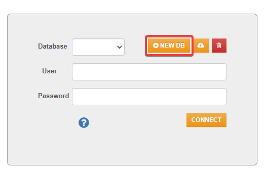
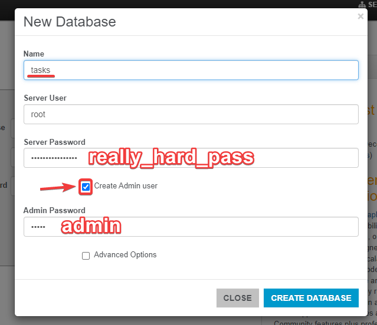

# Table of contents
- [OrientDB and todo app set-up guide](#OrientDB-with-docker-set-up-guide)
- [OrientDB description](#OrientDB-overview)
___
# OrientDB with docker set-up guide

- Clone the repository:
`git clone https://github.com/McCaron69/orientdb-demo.git`
- Move to repository folder:
`cd orientdb-demo`
- Use `docker compose up`
- Go to `http://localhost:2480`
- Create a database:
1. Select `NEW DB` button.

2. Set **Name** as `tasks`, **Server Password** as `really_hard_pass`, select **Create Admin user** checkbox and set **Admin Password** as `admin`.

- Stop containers using `Ctrl+C`
- Use `docker compose up` again
- Now you can test todo app, which could be accessed through `http://localhost:8080/` and OriendDB through `http://localhost:2480`
___
# OrientDB overview
- OrientDB is an open-source NoSQL database.
- It offers scalability and high performance.
- Is really secure.
- Is written in Java.

## Features of OrientDB
- Uses a [multi model approach](#orientdb-models).
- Supports Tinkerpop 2.x and 3.x (a graph computing framework).
- Supports ACID transactions.
- Supports schema-full, schema-less and schema-mix.
- Offers extended SQL and Gremlin (query language).

## OrientDB Studio
A very convenient web interface for working with databases.
Possbilities:
- Run queries
- Edit graphs
- Manage schemas
- Manage security
- Manage databases, servers and cluster (with enterprise edition)
- Query profiler (with enterprise edition)
- Query audit logs (with enterprise edition)
- Backup management (with enterprise edition)

## OrientDB models
- Graph
- Document
- Key/Value
- Object
- Reactive
- Geospatial